> Written and answered on a best effort basis. It might contain wrong answers.
> Copying without questioning leads to your ruin!

## 1. Introduction into Epigenetics

### What is epigenetics?

* studies on heritable changes
  + of gene expression
  + of cellular phenotype
  
* caused by mechanisms other than changes in the nucleotide sequence

### What happens in DNA methylation?

* methylation of the 5th C-atom of cytosine
  + 5-Methylcytosine

* occurring in the CpG context
  +   both strands of the DNA are recognized and methylated

* dynamic process
  + active methylation (_de novo_: DNMT3a/b, conservation: DNMT1)
  + de-methylation (TET1/2/3, BER)

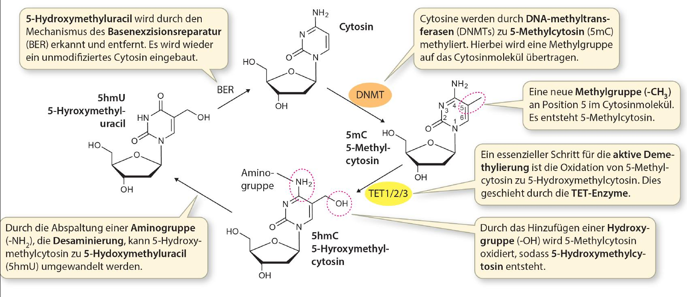{width=50%}

* DNA methylation is also used to define the parental strand during replication

### How can DNA methylation affect gene expression?

* CpG islands are cytosine and guanin rich regions in the genome

* conserved region in or close to the promoter

* unmethylated = gene is active
  + TF can bind &rarr; gene is expressed

* methylated = gene is silenced
  + TF can not bind &rarr; gene not expressed
  
* methylated DNA can interfere (block or enhance) the binding of
transcription factors

* methyl binding proteins
  + recognize methylated CpG sites
  + recruit histone modifying enzymes &rarr; chromatin changes

### What are histone modifcations?

* DNA is wrapped around Histones (protein of a certain type)
  + DNA + core histones &rarr; nucleosome

* Addition of H1 (linker histone) &rarr; 30nm fibre (less active genes)

* Biochemical modifications of core histones
  + influence affinity of linker histone (H1)  
  &rarr; consequence is change in chromatin structure  
  

* Histone tails (N-terminal) get modified
  + position and type influence the outcome (activation or repression of transcription)
  
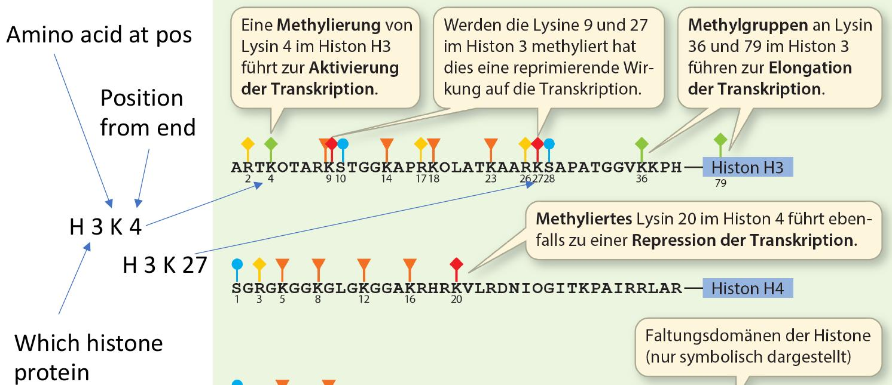{width=50%}

### Which histone modifications are associated with active transcription or heterochromatin?

* Acetylation of histones at N-terminal ends is associated with transcriptional activity

* Lysins in terminal ends lead to positive charge that interacts with negative charge of DNA
  
* Acetylated lysins reduces positive charge
  + Loss of affinity to DNA

* Change of charge also effects interaction of nucleosomes among each other
    + Loss of 30nm filaments
    
* Good overview: [Link to overview table (https://doi.org/10.1186/s13059-019-1870-5)](https://genomebiology.biomedcentral.com/articles/10.1186/s13059-019-1870-5/tables/1)

### What is Waddington‘s epigenetic landscape model?

* 1957: Conrad Waddington's concept of an epigenetic landscape to represent the process of cellular decision-making during development. At various points in this dynamic visual metaphor, the cell (represented by a ball) can take specific permitted trajectories, leading to different outcomes or cell fates.

* Dellular differentiation can be considered an epigenetic phenomenon, largely governed by changes in “epigenetic landscape” rather than alterations in genetic inheritance

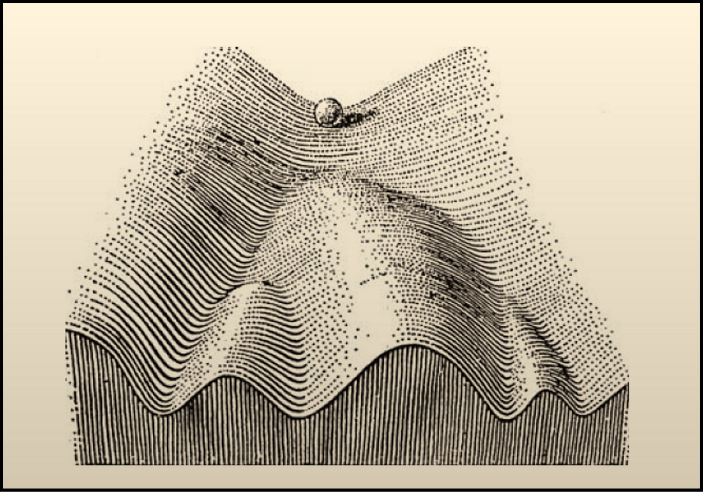{width=50%}

* Chromatin structure of germ cells loosened and DNA
methylation is reduced to a minmum &rarr; totipotent cell types

* cell-type specific pattern established in following cell division cycles &rarr; cell-type specific gene expression

### What is imprinting?

* Allele-specific expression of a genev (either from the maternal or paternal allele) via CpG methylation

### Explain how mosaic colouring of cat fur comes about?

* Random activation or inactivation during embryonic development of one of the X chromosomes, where the responsible gene for fur coloring is located

## 2. Understanding gene expression with RNA sequencing

### What is RNA-seq?

* Sequencing of mature mRNA molecules

* Fragmentation of transcripts and reverse transcription to cDNA (hexamer priming)

* Generation of ds-cDNA fragments &rarr; high throughput sequencing

* Can be used to estimate gene expression or identify novel transcriptional changes

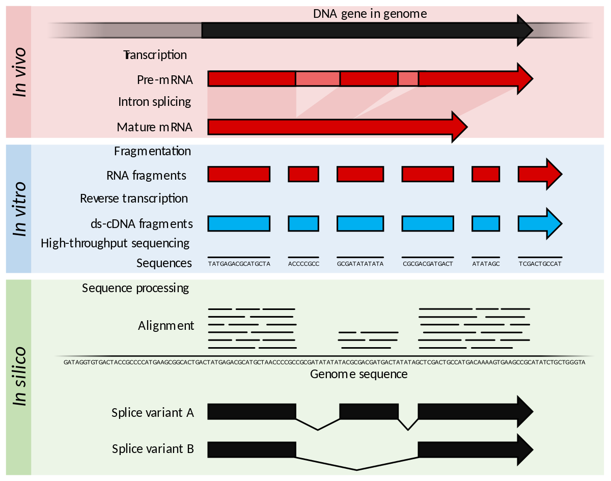{width=50%}

### How to obtain RNA counts?

* Two strategies to map and quantify RNA-seq reads

1. Mapping to the transcriptome  
    + Reduced search space
    + Can only assign reads if they originate from known transcripts
    + No novel transcripts

2. Mapping to the genome  
    + Large search space for alignment
    + Methods need to be splice-aware
    + _in silico_ splice reads to consider introns
  
* Transcript counts are aggregated to obtain gene level counts

* Genome mapping &rarr; count reads per gene bin 

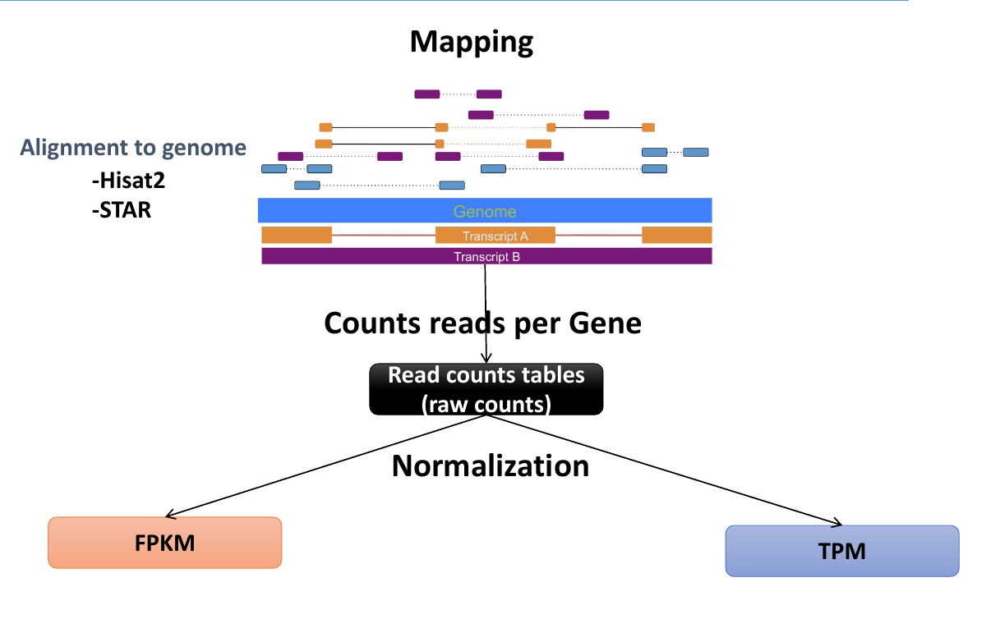{width=50%}

### Why do we need to normalize RNA-seq read counts?
 
* gene expression measurement
  + to compare expression between genes
  + to compare expression of a gene between samples

* An estimation of the average copy number of a gene‘s RNAs

* We need to consider
  + Differences in gene length  
  &rarrw; longer genes produce more fragments  
  
  + Differences in library size
    + Number of reads obtained per experiment by the sequencer is different

### What are TPM and RPKM normalization?

* Metrics to adjust raw read counts for gene length and sequencing depth

* Very similar but calculated in different orders

* RPKM (Reads Per Kilobase per Million Mapped reads)
  + single end sequencing &rarr; FPKM for paired end reads
  + Normalize read counts by number of reads mapped scaled by arbitrary scaling factor (10^9)
  + Scale normalized read counts by gene length (sum of exons)

* TPM (Transcript per Million)
  + T = total number of transcripts sampled in sequencing run (weighted by length)
    + Sum over all genes estimated number of transcripts per gene ("one read per transcript")
  + Number of reads is taken with respect to length of gene G and all other genes 
    + M number in RPKM treats each read the same
  + Normalize read count by gene length
  + Normalize by sequencing depth

### Why is TPM better?

* RPKM/FPKM and TPM normalize both for sequencing depth and gene length

* For RPKM/FPKM column sum is different between samples &rarr; pie chart with different sizes
  + Values are not comparable between samples e.g. same value between replicates are different proportions or relative expression

* With TPM all columns sum up to 1 Million &rarr; better comparison

### How to quantify transcript expression?

* Quantification can done by mapping reads to transcriptome &rarr; increased multimapping reads because transcripts share exons

* Reads are not completely aligned &rarr; approximate position is enough to account for expression

* TPM normalization for transcripts
 + correction is relative to transcript length
 + Now the factor T is the sum of the estimated number of counts per transcript (sum of the whole transcriptome)

### What is the effective length of a transcript?

* Transcript length required to calculate TPM

* Effective length depends on experiment (fragmentation step)
  + Fragment size of paired end sequencing
  + Some ranges of fragments are more/less likely &rarr; very small or very large fragments are unlikely to be present

* Long fragments have less starting positions in transcript T compared to smaller fragments with many more

* Effective length = L - f + 1

* For smaller fragments the effective length becomes larger

### Which biases does Salmon take into account?

* Salmon uses a EM model to account for biases from RNA-seq experiments

* Fragment length
* Positional bias (average mapping percentage &rarr; more reads at 3' end of transcript)
* GC bias (PCR protocol biased not to amplify GC rich fragments)
* Read start bias (Random primers prefer certain positions over others)

## 3. Analysis of differential expression data and interpretation {#deg}

### Which normalization does DEseq2 use?

* Counts of fragments aligned to gene i in sample j proportional to
  + gene expression
  + length of gene
  + sequencing depth
  + preparation factors like PCR

* Median of ratios method (for each gene calculate count ratios)
 + create pseudo sample (row-wise geometric mean)
 + calculate ratio of each sample (count) to pseudo
 + calculate column-wise median to obtain scaling factor
   + we assume for most genes a ratio of 1 but difference in sequence depth creates slightly differing values
   + median a good estimator of the differences in sequencing depth

### What is the advantage of the negative binomial compared to the Possion distribution, when looking at counts?

* Assuming all positions in a transcript have same probability to produce a fragment &rarr; function of frequency of expressed content in sample

* For one gene Binomial sampling distribution; for million of reads and small proportion for each gene this becomes a Poisson distribution

* In a ideal world the proportion of mRNA stays exactly the same between technical replicates

* Biological variation across samples produces "overdispersion" relative to Poisson dist.
  + For Poisson mean and variance is always the same

* Negative Binomial to capture this (Poisson with varying mean)
  + Mean different from variance that needs to be modelled
  + Can model more complex shapes
  + Ratio of standard deviation and mean captured = CV value

### What is a p-value?

* significance level at which we reject null hypothesis

* probability of observing a difference/extreme value given the null hypothesis is true

### What does FDR mean

* TypeI (false positives) and TypeII (false negatives) errors

* calculation based on rank of p-value and specified sigma value

* Multiple testing &rarr; probability of at least one false positive increases 

* Adjust p-value to acknowledge multiple testing

* False Discovery rate used to control proportion of false positives

* How many of the rejected null hypothesis are false positives

### Why do I need to do FDR?

### How does DEseq2 fit the dispersion for genes?

* Dispersion is part of variance in negative bionomial

* Dispersion plot &rarr; each black dot is dispersion estimate per gene (maximum likelihood)

* Small read counts produce some sort of bias on dispersion

* DESeq2 tries to fit a trend line to capture behavior of dispersion

  + as function of the mean read counts

* Genes dispersions are shrunken towards the trend line which is then used in Wald test to estimate log fold change ratio
 + More meaningful for low read counts that would normally lead to high ratios (lfc)

* Dispersion outliers not shrunken, if strong difference between fitted line and estimated dispersion for gene

### What is an MA-plot, and how to read it?

* M (log ratio) versus A (average) : MA plot

* x-axis = log2FC, y-axis=mean of normalized counts

* significant p-values highlighted with color

* Shows significant difference/ratios in read counts depending on normalized read counts

* Small counts produce large ratios but are not significant
  + DESeq2 reduces the log2FC by LFC shrinkage procedure (done before Wald test)

* Certain number of counts/threshold for significant thresholds

### What is the Gene Ontology?

* controlled vocabulary to describe gene products (proteins, RNAs)

* standardized, species-neutral way of representing biology

* DAG of defined terms to describe gene product attributes
  + "is-a" relationship
  + "part-of" relationship

* divided into 3 subontologies
   1. Cellular component
   2. Molecular function
   3. Biological process

### How is functional enrichment estimated?

* Given a set of DEGs &rarr; asses if certain terms are enriched in this selection

* statistical test for picking set G with certain function/term f

* Null hypothesis &rarr; no function/term is enriched; genes with term f appear with same frequency as in the whole gene set

* Use the hypergeometric distribution to compute the p-value (or Fisher’s exact test)

## 4. Analysis of ChIP-seq data

### What is ChIP-seq?

* Chromatin ImmunoPrecipitation combined with sequencing

* Used to identify the location of protein binding sites (e.g. TF, Co-Factors or modified histones)

* 2 Types of sequenced data
  + ChIP data
  + Input data (background signal)

* ChiP data generation
  + Cross-link protein to DNA
  + Shear DNA strands
  + Add antibodies to immuno precipitate target protein
  + Unlink precipitated protein and sequence DNA
  
* Input data generation
  + Same as ChiP data generation but without immunoprecipitation step 

### Why do we need to normalize ChIP-seq read counts?

* To detect differentially enriched regions on ChIP data

* Comparable data &rarr; different sequencing depths

* Extract information from IP experiment 

  + For background signal (Input data)
  
* TODO: add how to normalize ChIP-seq read counts

### What is indirect binding?

* Protein of interest does not bind directly to DNA but to other protein(s), that binds to DNA

* Can be quiet complex

* Important to keep in mind in analysis of ChiP-seq experiment analysis

* Direct or indirect binding cannot be directly inferred from the resulting sequencing data

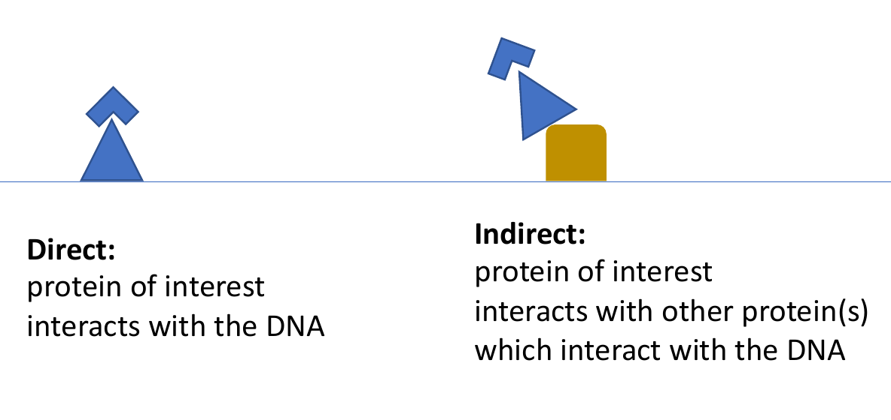

### Explain basic quality steps for ChIP-seq data?

* First step on raw sequencing data

* Count reads in different bins of the genome

* Assessing similarity (e.g. using Deeptools multiBamSummary)
  + To get correlation between replicates and between ChIP and input data

* Visualising the correlation as heatmap (e.g. using Deeptools plotCorrelation)

* Second step to check if IP has worked correctly (IP efficiency)

* Count reads in bins over the genome for input and ChIP, then sort and normalize it w.r.t. highest number of reads in bin

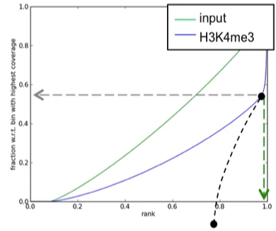{width=48%}
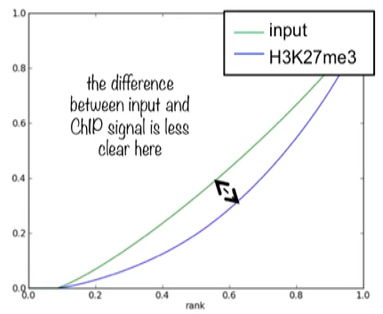{width=48%}

* Curve shows if enrichments are localized or are very strong

* If the plotted input and ChIP curves are closer together, the quality is not very good

### How does peak calling with MACS2 work?

* Scroll along the genome in windows

* Call significant windows using Poisson (with dynamic expected value $\lambda_{local}=max(\lambda_{BG}, \lambda_{1K}, \lambda_{5K}, \lambda_{10K})$, lecture on ChIP seq from Ibn-Salem) distribution to distinguish signal from background noise (to calculate p-values, and subsequent FDR)

* Merge significant windows to call peaks

* Read shifting conducted as follows:

  * Paired end sequencing &rarr; Sequencing a fragment from both ends generates two slightly shifted read coverages
  * Usually a peak from the positive and a peak from the negative strand would be received (left and right from the position, where the protein is sitting)
  * Fragment size is estimated (by distance of the two peaks or from paired end information)
  * MACS2 shifts the peaks towards the center (half of the fragment length)

### What are the 6 core histone modifications?

* TODO: check lecture 4 slide 40 and 44

* TODO: create list of Histone Modifications

### How can ChIP-seq data be used to locate tissue-specifc enhancers?

* co-activator protein p300 binds to many other proteins (transcription factors) and also interacts with enhancer regions/proteins that sit at enhancer regions  

* Different p300 peak regions define tissue specific enhancers

* Before ChIP-seq enhancers were mainly found via conservation analysis of multiple sequence alignments of non-coding regions of different species

### Mention approaches for differential peak calling!

* Peaks have to be found first

  + Independent peak analysis
  + Sliding window approach
  + Binning (Same size windows, non overlapping)
  
* Comparison of peaks between different conditions

  + Qualitative comparison (peak or no peak)
  + Quantitative comparison
  + TODO: listen again to the following parts
  + Normalize
  + Hypothesis testing
  + Probabilistic modeling
  + Consider local dependencies
  
* Bdgdiff in MACS2

  + Binning based
  + If only one replicate is given
  + First calls peaks using Input and ChIP bam files
  + Secondly outputs bedfiles for log-likelihood ratio test result (cond 1 > cond 2 and vice versa, similar enrichment in both conditions)
  
* diffBind

  + peak based
  + independent from peak caller
  + considers replicates
  + uses only ChIP reads
  + recounts the reads in peaks
  + uses DESeq2 method for normalization and differential abundance testing
  
* Both methods treat neighboring peaks individually

* HistoneHMM

  + Read counts in bins
  + Introduce further states to represent differential regions

## 5. Analysis of DNA methylation data

### Why does sodium bisulfite treatment allow DNA methylation analysis?

* Treatment of DNA with bisulphite &rarr; reaction converts unmethylated cytosines to uracils, methylated cytosine (5-methylcytosine) does not react with bisulphite.

* High efficiency 

* During PCR uracil becomes thymine

### Why is WGBS called the gold standard in DNA methylation analysis?

* Cytosine methylation across the entire genome at single base resolution

* Measures genome-wide CpGs 

* Unbiased

### Why is bisulfite-seq data difficult to analyze?

* Up to four DNA strands have to be analysed
  
  + Top and Bottom strand are methylated 
  + Leads to 4 different strands after PCR amplification

* Mapping
  * increased search space (more positions, where sequence can map)
  * heterogenicity of methylation levels of individual CpGs in profiled cell populations ([Link to article](https://doi.org/10.1093/nar/gkaa120))

### What is the asymmetric mapping problem?

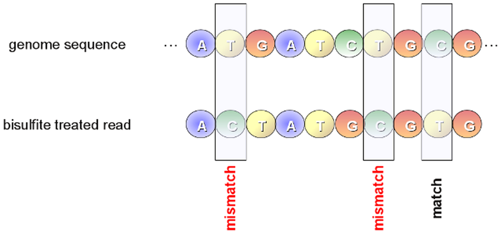{width=70%}

* bisulfite treatment: unmethylated cytosines are converted to thymines during the PCR amplification

* This conversion must be taken into account during alignment by allowing an asymmetric mapping
  * thymine in a read mapped to a cytosine in the reference genome sequence &rarr; match 
  * cytosine in a read mapped to a thymine in the genome sequence &rarr; mismatch.

### How do reduced representation mappers perform alignment?

* Convert C to T in both reference and read

* After the conversion conduct mapping with "normal" mapper (e.g. Bowtie)

* False positive alignments

### What are PMDs and how does MethylSeekR find them?

* Partially methylated domains (PMDs) are characterized by highly disordered methylation, resulting in an average methylation clearly below the genomic background level

* High variation in methylation level in large domains in the genome

* generally large &rarr; do not need to be modeled at the single CpG level (summarised using sliding window)

* MethylSeekR uses sliding window of 101 CpGs

* Calculate &alpha; values (model methylation value for each CpG as being generated from beta binomial distribution)
  * &alpha; < 1: favor polarized methylation close to 0 or 1
  * &alpha; > 1: biased to intermediate methylation (~0.5)

### How does RnBeads do differential methylation detection?

* Target: quantify differences in DNA methylation between 2 sample groups

* Based on CpGs and genomic regions of interest (e.g. found by MethylSeekR, annotation or promotor regions,...)

* LIMMA Model (easy integration of co-variates e.g. batch effects )
  + use methylation value (ratio of methylated against unmethylated CpGs)
  + fit model with matrix of methylation values of different samples
  + null hypothesis: no difference in methylation between different groups
  + p-values for significance of each CpG

### Why is epigenetics on cell-free DNA interesting?

* Cell-free DNA (cfDNA) is DNA, that is relased into the blood stream by cells via e.g. Apoptosis, Necrosis or Secretion

* This DNA can be epigenetically studied e.g. for methylation patterns

* These methylation patterns can then be mapped to different tissues 
  + Mapping can be learned supervised or unsupervised
  
* Direct marker analysis possible, if markers for specific diseases are given

* Monitoring of diseases would be possible (e.g. heart disease would give higher proportions of cells with heart methylation patterns in blood)

## 6. Analysis of open-chromatin data

### What does open-chromatin mean?

* DNA normally wrapped around nucleosome

* Depending on context (active expression, histone modifications etc.) it's
either tight or loosely wrapped around histones

* DNA accessible for binding proteins

* Expressed genes, regulatory regions e.g. active promoters, enhancers

* Can be bound by TFs, RNApol, co-activators, scaffolding proteins

### Which assays are commonly used to profile open-chromatin regions?

* Cut/Tag/Methylate accessible DNA regions &rarr; enrich fragments &rarr; sequence

* DNaseI-Seq

  + DNA digestion with DNaseI enzyme &rarr; cuts accessible dsDNA
  + Purification and selection of short double hit fragments
  + High throughput sequencing &rarr; Relative enrichment of accessible regions

* ATAC-Seq
  + Similar approach to tagmentation based bisulfite-sequencing
  + Direct tagging of accessible regions
  + Tn5 transposase cuts accessible DNA and inserts sequencing adaptors
  + very sensitive (less cells needed then for DNaseI-Seq experiment, nowadays even single-cell)
  + Purification and high throughput sequencing &rarr; Relative enrichment of accessible regions
  + Different lengths of fragments (e.g. 1, 2 or 3 nucleosomes)

* NOMe-Seq
  + Usage of GpC methyltransferase
    + Only methylation of GpC
    + Not a native enzyme in human &rarr; GpC methylation not naturally happening
  + In vitro methylation of GpCs &rarr; nucleosome depleted regions (accessible) (only regions where nothing else is binding)
  + Bisulfite sequencing
  + Genome wide screen of nucleosome occupancy
  + Expensive (WGBS) and complicated data analysis

  
### How is NOMe-seq different to other assays?

* NOMe-seq is not an __enrichment__ procedure

* Genome-wide screen of accessible regions

* Quantitative assessment of __GpCs__ and __CpGs__ &rarr; two types of information

* Interpretation in context of accessibility and natural methylation

### What is the underlying idea of the gNOMeHMM approach for?

* only GC positions are measured (GCH)

* GCG &rarr; it is not clear where methylation comes from (was it already methylated before enzyme treatment?)

* Openess value = C/(C+T) 
  + same as methylation value for WGBS
  + methylation (1.0) without conversion &rarr; open region
  
* Group GC dinucleotides with high methylation &rarr; open
  + adjacent are merged into peak &rarr; region of open chromatin

* Binomial HMM with 2 states (open and closed)
  + binomial distribution to capture mean of GC methylation
  
* Fisher's exact test of all open called regions
  + enrichment of "open reads" compared to a background distribution (4kb window)
  
* FDR correction
  + Peaks called along whole genome &rarr; regions with different coverage
  + Cluster regions/peaks genome wide
  + high read coverage = more sensitive 

### How does JAMM use mixture models for detecting peaks?

* Based on BED files find enriched windows
  + bins with higher mean / good signal-to-noise ratio
  + different size 500bp - 1kp &rarr; peak located in this window
  
* Gaussian mixture to cluster windows per chromosome
  + Understand distribution of open chromatin values (read counts) along windows
  + Learn mixture model to get clusters
  + multivariate &rarr; __replicates__

* Find peaks in enriched windows
  + assign genomic nucleotides/region to clusters to call peaks
  + find peaks in large window of read counts &rarr; dissect large windows

### Which aspect of ATAC-seq data is specifically modelled by the HMM in the HMMRATAC method?

* Random cuts &rarr; fragments of different lengths

* Dissect signal in fragments of different length

* Use fragment/signal information for peak calling

* Modeled by HMM that learns a mixture of gaussians
 + Explain different states of fragments (Nucleosome free, 1 Nucleosome etc.)
 
* Fragments of different length, when sequencing &rarr; e.g. one or two nucleosomes
  + Short fragments in center (open chromatin region)

* Model as HMM the three states Center (open), Background (no open chromatin) and Nucleosome (adjacent to center)
  + Decompose dataset into different fragment lengths
  + Learn Gaussion Mixture
  + Optimize parameters using Baum-Welch (expectation maximization)
 

### Which of the two assays are more similar ATAC-, NOMe- and, DNase1-seq and why?

* Signals in bins along genome &rarr; correlation plot
  + ATAC-seq and DNaseI-seq have highest correlation on signal level
  + Similar enrichment of open regions
  + Similarity to NOMe is smaller &rarr; quantitative nature of method (percentages)

* ATAC and DNase1-seq are more similar because we are cutting the open chromatin DNA somehow and sequence the fragments

* The accessible regions are then determined by enrichment in signal

### How can you compute overlap between peak datasets?

* Since peaks are just intervals of genomic regions you can use BEDtools
to intersect the region to find overlaps

## 7. Transcription factor binding prediction and footprinting

> If domain of TF is known, that does not mean the motif is also known

## How is a PWM estimated from aligned binding sites?

1. Create count matrix (columns &rarr; position; row &rarr; letters of alphabet e.g. nucleotides)

2. Normalize the counts in the matrix &rarr; Position Probability Matrix

* Probability of a given sequence can be calculated easily (multiply the normalized values for each symbol at each position) 

* Problem: if character not given in alignment/at a position in the PFM probability becomes always 0

* Solution: Add pseudo count

* PWM:
  + compute log-odds score for each entry in the above described PPM
  + Higher probability for character than background &rarr; positive value
  + Lower probability for character than background &rarr; negative value
  + Score for sequence can be calculated by summing up the values for character at specific position

### What is the disadvantage of a PWM?

* Sequences must be same length and have no gaps

* Considers probability of binding at individual positions of the motifs

* Positions in the binding site model are independent &rarr; a strong simplification (will have a impact on the 3D shape)

### What are SLIM models?

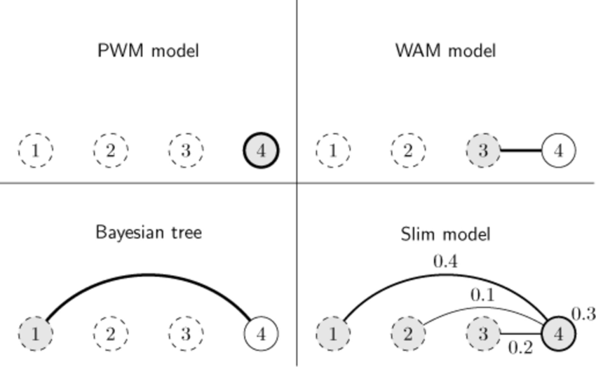{width=70%}

* WAM: dependency on previous position (e.g. Dinucleotide PWMs)

* Bayesian tree: conditional on __one__ previous position

* SLIM (Sparse local inhomogeneous mixture model): Mixture of conditional contributions for different previous and current position
  + Could be model with many parameters
  + Therefore some of the weights are pushed to 0
  + Inhomogeneous, because the dependencies and probabilities for each position can be different
  + All the other models are an instance of the SLIM model

### Which model performs better for TF modelling: PWM or SLIM?

* Overall SLIM performs better than PWM

* For some genes PWM is performing better (e.g. Znf143 of Rxra)

### Describe sequence based biases in open-chromatin data!

* To visualize the cleavage enzyme biases, sequence logos of multiple sequence alignments of the read start positions are created
 
* ATAC-seq smaller preferences than in TF binding motifs (max around 0.3 bit) but preference is given
  + palindromic
  + because two transposase molecules are involved in the cutting
  + larger window ~ 9bp of sequence bias (because of two molecules)
  + Shape preference &rarr; high minor groove width where transposase integrates

* DNase1 also small preference (not symmetric)
  + more local
  + Shape preference &rarr; clear preference to cut in minor grove
  + DNA-methylation increased directly after cut side (Methylation changes minor groove width which is beneficial for DNase)

* NOMe
  + GC has max. value, because this is measured
  + No bias adjacent to GC position
  + Position on left and right are not biased, because GCGs are excluded
  + Methylation pattern around GC methylation
  
* For all assays preferences in the minor groove around the cutting/methylation position were found

### What is computational footprinting?

* Dips in peaks/signal of open-chromatin data &rarr; TF bound to DNA (hinders DNase, ATAC to cut DNA)
 + expectation &rarr; dips are not observable in peak
 
* Predicted footprint regions are a good starting point for binding motif search

### How does the HINT method for footprinting work?

* HMM based

* Normalize cleavage signals

* Savitzky Golay filter for smoothing and slope

* Train HMM supervised with 1 TF-ChIP-seq data

### How does HINT-ATAC deal with the ATAC-seq bias?

* Correct cleavage enzyme bias
  + calculate bias for k-mer 
  + correct the read counts using this bias value
  
* HINT uses a Position Dependency Model (only relevant positions) to account for sequence bias

* Strand cleavage bias
  + Fragments of different length &rarr; nucleosome positions  (distinct strand bias)
  + Dips also present for transition from linker to nucleosome
  + HINT separates fragments according to their length (NFR, 1N, 2N+) &rarr; seperate signal to forward and reverse
  + HINT has several states for forward and reverse to treat them separately (2 transposase molecules)

* important to  model __strand__ and __decompose signal__ based on fragment length

### Which other aspects of HINT are important to do well on ATAC data?

## 8. Integrative prediction of gene expression

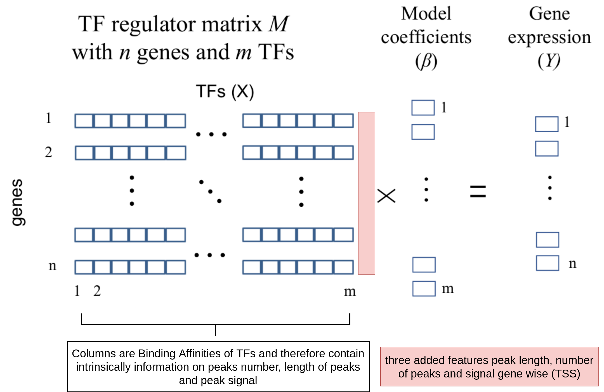{width=70%}

### What are shadow enhancers?

* Enhancers with partially redundant activity (If one is removed, gene regulation not really changed, because another enhancer is shadowing and preserves basic functionality)

* Often similar ChIP-seq binding

* Often within 50KB

* Makes analysis of regulation more difficult (not only location has to be found, but also if combination of these elements is relevant for gene regulation)

### What does sparse linear regression mean?

* Sparse in case of sparse linear regression means, that not all information is used for prediction

* More features than samples

* Select small subset of k features

### What is the Lasso penalty?

* Given the restriction that the sum of all features must be smaller or equal to a given value t

* $||B||_1\le t$

* Means that some $\beta$ values become 0

{width=70%}

### What is the Elastic-Net penalty?

* Extension of Lasso penalty

* Sum of L1 and L2 norm both multiplied with a value ($\lambda_1$ and $\lambda_2$ &rarr; sum = 1)

* Only L1 norm: lasso

* Only L2 norm: ridge (see image from question above) &rarr; encurages grouping effects

{width=70%}

* Elastic net is more flexible

* Elastic-net works better when there are correlated variables (features) &rarr; slightly more time-consuming but more general

* More computational intensive, because $\lambda$ value has to be optimized

### How to avoid overfitting?

* Cross-validation

* Split initial data into test and train data &rarr; test how good model works with unseen data

* Split test data again into train and test (k-times) &rarr; generalization of model

### Explain how open-chromatin peak data can be used to link TF binding to gene expression?

* ChIP-seq data &rarr; exact position of TF observable 
 + For each TF a separate antibody &rarr; to many experiments

* Open chromatin around TSS &rarr; probably enhancers

* Bound by TF &rarr; footprints

* TEPIC
 1. Peak calling with open chromatin
 2. Annotate TF i in each peak (affinity score)
 3. Calculate for each gene TF combination a "regulation" score
   + sum all affinity scores weighted by peak intensity and distance from TSS
   
### What are important assumptions in the linear model with TRAP-derived TF features?

* Peak/signal intensity &rarr; smaller peak could indicate that TF is less important for the regulation and vice versa

* Distance &rarr; peaks further distant from TSS contribute less to regulation
  + Based on observation that further away DNA elements interact less likely
  
* Affinity score / TRAP
 + bigger peaks contribute more to affinity score
 + larger DNA sequence scores higher affinity (multiple higher scores would be added compared to max/hit approach)

### What is the difference between nearest gene and window-based peak assignment?

* Window based: Window around TSS &rarr; all peak within are associated with gene

* Nearest gene: Assign peak to nearest gene (peak-centric view)

* Both methods are imperfect &rarr; biases

### What are confounders in the TF scores based on Dnase1 peaks?

* Length of the peak (correlated to TF affinity)
  + should be normalized
  + but still correlation is high just by chance (probability to bind to larger peak is higher)

* Signal

* Number of total peaks

* The 3 features were not included in the original model, but after adding these, the random permutation resulted in a stronger performance drop, than the random permutation with the original model
  + These 3 features are confounders

### Why is the Elastic-net more robust against bad features?

* Problem of random input data (permutation test) is more visible than with lasso
  + permuted input data &rarr; almost all features are selected
  + correct input data &rarr; only some features are selected

* Elastic-net: groups of correlated features recieve equal co-efficients

* Problem with lasso
  + encurages features to have 0 coefficients
  + is still selecting only a part of the features for permuted input data
  + it is harder to tell, if the model is bad or not
  + elastic-net should be preferred if possible

## 9. Identification of gene regulatory elements and their target genes

### How can one define regulatory elements?

* Identify elements important for gene expression
  + gene expression &rarr; TF in enhance and promoter
  + Some elements can be far away from TSS &rarr; element might be small
  + Identify association &rarr; elements regulate many genes

* REM = Regulatory Element 
  + enhancers or silencers
  + positive or negative effect on gene expression

* Open chromatin
  + TSS &rarr TF binding to promoter regions
  + DNA devoid of nuleosome &rarr; TF binding
 
* Regions of enhancer associated histone marks
  + Histone ChIP-seq e.g. H3K27ac, H3K4me1 (poised enhancer &rarr; may become active e.g. in stress situation), H3K122ac
  + association with enhancers shown in different experiments

* Regions of enhancer associated proteins
  + p300 ChIP-seq &rarr; p300 co-activator protein involved in enhancer complexes
 
* Define exact boundaries of REMs with this type of data is complicated
  + different peaks, not all involved in the same enhancer complexes

* Examples of REM identification
  + Unified Peaks Model with open chromatin data
     + consistency of multiple samples &rarr; merge (union) of peaks to define REM
     + found in > 1 sample
  + Random forest classifier to predict p300 sites (RFECS)

### Which histone marks were helpful in defining enhancers in RFECS?

* RFECS (TODO listen again)
  + Uses p300 sites as a proxy to define regulatory elements &rarr; many are bound but not all
  + Histone ChIP-seq &rarr; may cover a broader spectrum of enhancers and combinations 
  + Learn combination that might help to distinguish REM from none-REM   
    + Measure different ChIP-seq signal along p300 peaks (counting in bins) &rarr; used as features
  + Aim to distinguish REM from Non-REM
 
* Best performing/importance for random forest were H3K4_me{1,2,3}
  + simple definition of enhancer: mono-methylation > tri-methylation

### What is the difference between per-sample and per-gene learning? Explain using a regression setup!

* Two setups to use large datasets e.g. IHEC 
  + predict enhancer-gene regulatory maps
 
* Per-sample learning
  + necessary when only a few samples are available
  + learn parameters per sample ("column")
  + one regulator per sample &rarr; one coefficient vector per TF per __sample__
    + R (number of factors, enhancers) * S (number of samples) coefficients
  + correlation of single samples &rarr; identify certain sets of coefficients that are different between conditions
  + generalization over all genes &rarr; but genes are regulated differently
 
* Per-gene learning
  + applicable if large number of samples is available
  + learn specific gene-regulator interactions
  + learn parameter per gene ("rows")
  + one coefficient vector per __gene__
    + R (number of factors, enhancers) * N (number of genes) coefficients
  + understanding which genes are well predictable from epigenomics data
  + more models than per sample learning
   
  
### How can supervised segmentation be used to define gene-specific regulatory elements?

* Open questions:
  + how to identify REMs from DNaseI signal ?
  + how to link those to changes in gene expression ?
  
* Previous approaches performed simple association (window, nearest gene)

* Learn this association explicitly with regression model
  + Learn function to predict expression given type of data
  + interpretable coefficients and regulatory elements
  
* Identify regulatory elements to use

  + Individual peaks model
    + simple &rarr; not dealing with other samples
    + create anchor point (TSS)  and take all peaks in certain window weighted by distance
    + How much open chromatin in window &rarr; value as feature for regression

  + Unified peaks models
    + Identify overlapping bp in samples &rarr; REM for linear regression

  + Supervised segmentation
    + Variation in DNaseI signal across samples associated with gene expression
    + Strong signal &rarr; chromatin was accessible in many cells
    + complex 3D conformation of DNA, looping of further away regions &rarr; peak also resemble association of DNA regions with regulated genes
    + stable open region
    
* Instead of peak calling &rarr; segmentation problem
 + Some peaks are present even if gene is not expressed
 + Only signal in some samples with expression and in others not

* Discretization of expression values

* Count for every sample in small windows the DNaseI signal and compare, which segments correlate with response variable (Gene Expression)

* MDL to form larger segments of initial bins that have similar association with expression classes/levels

* MDL = Minimum description length
  + solve problem of model selection
  + Find balance between good predictive power and interpretability
  + many combinations of segments &rarr; enumerate segementation and select the one with best balance
    + model complexity &rarr; number of segments
    + model can discriminate between expressed and not expressed genes
  
* Segmentation for __each__ gene &rarr; could lead to slightly different segments for the same enhancer

### Why are STICHTIT REMs much shorter than for Genehancer?

* Genehancer = Validated enhancers from VISTA-db linked to genes
  + defined by p300 and other technologies &rarr; large domains

* ROI in Genehancer overlaps likely enhancer &rarr; Where is the region where TF is binding?

* Segmentation results in much smaller REMs on average

### What are disadvantages of the unified peaks approach?

* For example gene unified peaks model did not work very well

* A lot of open chromatin signal in front, in body and after the gene

* Unified peaks &rarr; blindly combines peak information from many samples
  + Over estimation of size of REMs
  + Peak annotation is completely independent of gene expression

* Also possible to have peaks at promoter region without expression &rarr; Polymerase already sitting at promoter (open-chromation) but no transciption

### What is Epiregio?

* Database of learned REM-gene interactions

* Based on STICHIT predictions of BLUEPRINT and ROADMAP data

* Larger search window around gene improved gene expression prediction (correlation)
  + Smaller window might not capture all regulatory elements (bad performing genes)

* Query
  + What are REMs for certain gene
  + What REMs are present in certain region
  
* Study
  + Effect of epigenetic drugs
  + Interpret TF-ChIP-seq peaks (which peaks belong to which genes)
  + Interpret mutations (link non-coding mutations to genes)

## 10. Studying the 3D organization of the genome

### What different chromatin conformation assays exist?

* General idea &rarr; DNA loop / interaction of DNA
  + Crosslink and fixate DNA parts
  + Digest crosslinked DNA (restriction enzymes)
  + Ligation &rarr; continuous sequence
  + Unlink and amplify with primers

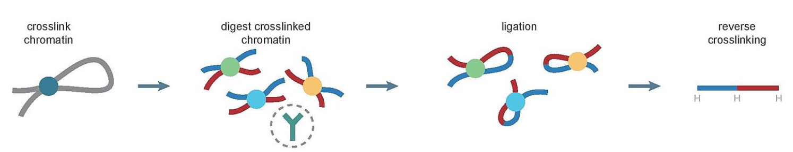{width=70%}

* Chromatin Conformation Capture (3C)
  + one vs one
  + Primers for specific interaction &rarr; all interaction with the regions
  + Amplify with PCR &rarr; statement if interaction exists

* Chromatin Conformation Capture-on-chip (4C)
  + one vs all
  + Extension of 3C
  + 2 primer for one region
  + amplify ligated products that consist of ROI plus anything else
  + define one locus and study all interactions with it
  
* Chromatin Conformation Capture Carbon Copy (5C)
  + many vs many
  + large set of primers
  + amplification of all combinations
  + e.g. Primers for all gene promoters

* Hi-C
  + all vs all
  + Add biotin prior to ligation
  + Pull down all ligated fragments with biotin
  + Enrichment method for all DNA-DNA ligated fragments
  + Deep sequencing required to study interactions genome wide

* ChIP-loop (ChIP-seq + 3c)
  + one vs one
  + Antibody against protein of interest
  + Pull down ligated fragments with POI
  + Perform 3C

* ChIA-PET (ChIP-seq + Hi-C)
  + all vs all
  + Enrichment of ligated fragments that were immunoprecipitated by POI &rarr; Hi-C on subset

### What is a contact matrix in this context?

* Sampling pairs of DNA-contacts

* Amount of DNA-DNA contacts/reads mapped to different positions in the genome

* Symmetric matrix/heatmap
  + Each dot is 10 kB window
  + Shows interaction of regions &rarr; darker color means high/lot interaction

* Similarities between different enzymes
  + Assay &rarr; result is function of decisions during assay e.g. used enzyme 

### What are TADs?

* Topologically Associated Domains &rarr; regions of high interaction frequency
  + very few interactions with neighboring regions

* Study structure emerging from these contacts

* Take half of contact matrix and make diagonal the x-axis

* Triangles &rarr; lot of interaction in this domain/interval

* Very few interactions between domains/intervals &rarr; TADs
  + Hierarchy in terms of interactions &rarr; broken between TADs by boundary

* Combined with gene expression data &rarr; alternating A & B compartments
  + Active compartment &rarr; highly expressed genes/histone marks associated with active transcription
  + Inactive compartment &rarr; low expression of genes / chromatin condensed

* B-compartment close to lamina nucleus &rarr; lamina associated domains (larger TADs)

* A-compartment inside and may co occur with speckless

* Agreement of TADs and epigenomic organisation and gene expression

* Enhancer of expressed genes must be part of TAD &rarr; otherwise we would see interaction in Hi-C view

### How are loops formed?

* Formed by cohesion protein

* Multi-subunit protein complex of SMC1, SMC3, RAD21 and SCC3 &rarr; forms a ring

* Essential for TADs and loop formation

* DNA is pulled through the cohesion ring 

### How to define super-enhancers

1. Identification of enhancer locations
    + ChIP-seq experiment for TF &rarr; peak calling

2. Clustering of enhancers
    + Distance threshold is 12.5 kb &rarr; stitching/grouping regions of not to large distance

3. Identify super-enhancers
    + Mediator enrichment &rarr; complex involved in enhancer-promoter looping
    + Certain regions have massive mediator enrichment (ChIP-seq)
  
* Large regions with many peaks and much mediator &rarr; super enhancers

* Involved in differentiation process e.g. cell identity genes

* Loss of cohesion results in loss of TADs/loops

* cohesion loops control super-enhancer activity
  + If cohesion is depleted, super enhancers have contact to other regions that they normally do not have

### Which TF is involved in stable loop formation and by interaction with which protein complex

* CTCF (Boundary transcription factor) is part of boundary elements, loop anchors

* Not essential for chromatin interactions

* Cohesion stops if two opposing CTCF sites are present &rarr; loop extrusion stops
  + orientation is important &rarr; forward and reverse strand
  + Cohesion doens't stop if CTCF isn't opposing
  
* Averaging over many cells &rarr; latency in CTCF removal results in stable loop formation

### How to call TADs from Hi-C data?

* TopDom method
  + Idea &rarr; move square of certain size along x-axis
    + Find points where number of contacts is much smaller compared to neighboring regions(shifting the square)
    + local minimum along bin signals
    + bin signal is average contact frequency in square
  1. Compute normalized signal per bin
      + w is bin size
        + U~i~ = upstream windows, D~i~ = upstream windows
      + Sum contact frequencies in all pixels &rarr; normalize by pixels in square
      + Compute normalized signal per bin
  2. Move square and find square with minimum interaction / minima in signal &rarr; boundary
  3. Filter false positive (overall not many interactions in region but local minimum)
      + compare between and within interaction using wilcox rank sum test
      + __between__ interaction = signal in bin
      + __within__ interaction = signal in upstream and downstream windows
  * To check correctness: CTCF ChIP-seq signal at boundaries, PolymeraseII &rarr; stop's cohesine at least some time TSS

* HiCCUPS (Juicer)
  + Does alignment and chimera handling, merging, sorting, duplicate removal and map creation
  + Loop calling &rarr; region in matrix with adjacent pixels with higher number of contacts (read counts) than local/close background
  + use GPU to scan trillions of pixels
  + checks anchors for CTCF binding motifs as additional information for loop

### How can one integrate Hi-c data to predict gene expression with epigenomics data?

* predict gene expression not from TF but from chromatin data
  + number of peaks, signal intensity

* not use affinity data anymore &rarr; instead link peaks to TSS

* Input: contact matrix and epigenetic measurement (e.g. DNaseI-seq peaks)

* Identify associated peaks in far away regions with Hi-C window
  + Define Loop anchor window
  + Take peaks from HiC/Hi-ChIP loop window that overlap loop anchor windows

* Predict gene expression using associated peaks that interact with chromatin in a window around this TSS

* Again: linear regression (INVOKE) &rarr; elastic net 
  + 6 features (at promoter and at loop windows): number of peaks, DNaseI signal, sum of peak lengths weighted by distance 
  
* HiC/Hi-ChIP data boosts performance of model compared to baseline (only peaks around promoter) 

* also possible to study, if TF binds to loop side or at promoter side
  + same model but now with TF features at promoter and at loop windows

## 11. Integrative analysis of ChIP-seq data with chromatin state segmentation

### What is chromatin state segmentation?

* Given multiple tracks of histone marks &rarr; define regions where particular combinations are found

* Find regions in genome where certain marks with similar functional impact are enriched

* States * Modification marks martrix

  + Row = frequency of each histone mark in each state

* All genomic regions labeled with this state show evidence for this histone mark

### What is the advantage of chromatin state segmentation?

* Allows interpretation of histone mark combinations
  + Based on knowledge of single histone marks

* Overlap with annotation features &rarr; function(al) impact

* Growing set of ChIP-seq experiments &rarr; working with individual peaks not feasible
  + Joint analysis and functional annotation

### How does ChromHMM do the segmentation (underlying model/probability distribution)?

* Unsupervised HMM approach to learn states

* Genome split into non-overlapping 200bp intervals

* Discretization of Histone marks (signal)
  + Convert to binomial with Poission distribution &rarr; 1 = mark present, 0 = mark not present

* Multivariate bionomial distribution

* Each state is a multivariate bionomial because histone marks are bionomial

* Fixed number of states &rarr; parameter
  + HMM learns transition- and emission probabilities  
  + Probability for each mark learned by segmenting the genome into states

### How can I compute a unified chromatin state model over several cell types?

* Given multiple cell lines &rarr; comparison of epigenoic activity

* ChromHMM supports joint learning

* Virtual concatenation of histone signal tracks
  + each chromosome * number of samples

* Concatenation of each epigenome &rarr; single data vector

* HMM learned on merged vector

* State definitions common in all samples &rarr; direct comparison possible

* Location might be different &rarr; cell type specific states

### How can I use chromatin states to predict cell types of origin for GWAS SNPs?

* SNPs associated with certain diseases

* Chromatin state overlapping SNP &rarr; functional impact derivable

* SNPs can be found in active promoters across all cell types

* Cell type specific effects observable &rarr; SNP overlaps only in one tissue a chromatin segment

* In K562 a sig. number of SNPs overlap with cell specific strong enhancers
  + Might be interesting tissue/cell for further experiments

* Non coding mutations &rarr; effect in cell types unknown
  + SNP may overlap enhancer (active) = SNP with effect
  + SNP may overlap non active enhancer = SNP without effect

### Why is EpiCSeg better than ChromHMM?

* EpiCSeg uses count signal compared to the discretized signals in ChromHMM

* Negative Binomial used to model count data [see lecture 3](#deg)

* Account for over dispersion of histone count data

* Counts are more robust (Discretization is more robust to outliers but creates noise at decision boundaries)

* Improves correlation with actual transcription

* Improves robustness of segmentation between biological replicates
  + high agreement expected
  
### Which statistical approach is used in Sciddo?

* Chromatin state maps and emission probabilities are called with different tool

* Emission probability is converted to state similarity score &rarr; state dissimilarity matrix

* Used to find discriminatory regions in terms of epigenome regions

* Scan for regions with difference

* Generate/calculate score &rarr; pick regions where score is different between conditions
  + Differential chromatin domains &rarr; local score statistic 
  + Calculated along bins
  
* Local score statistic &rarr; given a sequence of scores find subsegments of maximum positive score
  + p-value can calculated for each subsegment
  + Scores in random sequences follow Gumbel distribution &rarr; null distribution

* Aggregated into Differential Chromatin Domains (DCD) &rarr; large regions with difference in epigenome

### What advantages do differential chromatin domains have compared to individual peak analyses?

* Testing SCIDDO vs. peak calling

* Predict differential expressed genes using peaks or domains overlapping annotation elements
  + gene body
  + body + 3 enhancer elements

* Gold standard &rarr; DEG from RNA
  + How many of these can be explained by differences in chromatin domains, individual peaks

* Compared to single differential peaks CDCs always performs better (F1-score, Accuracy)

### Why can use differential chromatin domains to reason about similarity of cell types?

* Similar tissues/ cell types will have very similar chromatin &rarr; less DCDs

* DCD's capture differences in gene expression, enhance usage etc.

* Very different cell types &rarr; more DCDs because genes, enhancers are different

### How does ChromDet learn chromatin determining regions?

* Study used Blueprint data with 6 different histone/chromatin marks ChIP-seq data

* Idea: Determine regions that differentiate cell types
  * Genome segmentation with ChromHMM &rarr; simplified with 5 states
  * Chromatin states are used to determine chromatin determining regions (CDR)
  * CDR specific for individual or groups of cell type

* Method uses multiple correspondence analysis (MDA)
  * Matrix encodes sample * state annotation (each region in the genome)
  * Dimension reduction to cluster samples into chromatin sample space &rarr; what samples are similar/close by
  * Project clustering to find co-occurring chromatin state patterns according to the clustering
  * Which chromatin state patterns of a region in all samples determine a state 
  * state patterns (fingerprints) that correlate with assignment to sample space states

* MDA is similar to PCA &rarr; categorical data
  + component to explain variance
  + chromatin state information is able to explain difference e.g. different cell types generated or amount of differentiation

